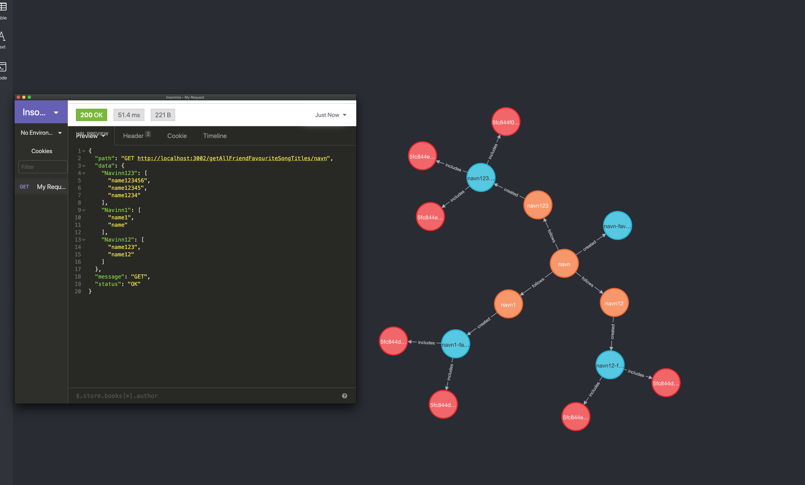

# Spotify API Clone

Developed in a team of 2, we made a REST API for a Spotify-like music application that utilizes the Java Spring Boot framework to create the API and microservices supported by MongoDB and Neo4j. 

This API has two microservices: `Profile` and `Song`.

## Technologies Used

- Java
- Spring Boot
- [MongoDB](https://www.mongodb.com/)
- [Neo4j](https://neo4j.com/)

The MongoDB database is used for storing song information, while the Neo4j graph database is used for storing profile information, their relationship between other users and their liked songs. 

     

   

Click [here](https://navn.me/spotify-api-clone) for usage and documentation.  

## Contributors
- [Clara Chick](https://clarachick.me/)
- [Navinn Ravindaran](https://navn.me/)

